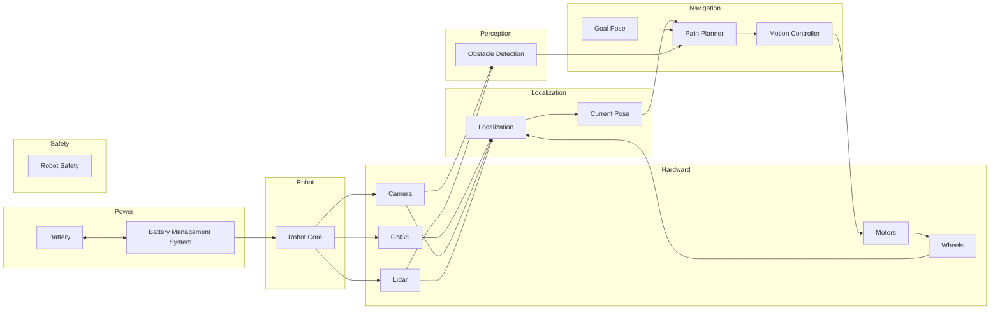

```mermaid
flowchart LR

subgraph Robot
    RC[Robot Core]
end

subgraph Localization
    L[Localization]
    CP[Current Pose]
end

subgraph Navigation
    GP[Goal Pose]
    PP[Path Planner]
    MC[Motion Controller]
end

subgraph Perception
    OD[Obstacle Detection]
end

subgraph Power
    BMS[Battery Management System]
    B[Battery]
end

subgraph Safety
    RS[Robot Safety]
end

subgraph Hardward
    GPS[GNSS]
    Li[Lidar]
    Cam[Camera]
    W[Wheels]
    M[Motors]
end

RC --> GPS
RC --> Cam
RC --> Li

GPS --> L
Cam --> L
Li --> L

L --> CP

CP --> PP
GP --> PP

Cam --> OD
Li --> OD

OD --> PP

PP --> MC

MC --> M
M --> W

W --> L

B <--> BMS
BMS --> RC
```
